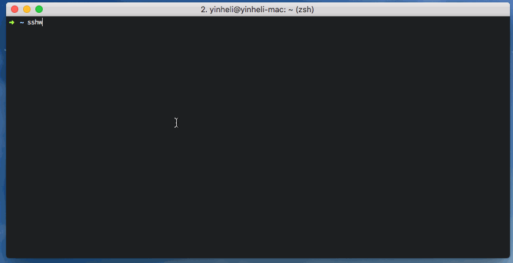

# sshw

 

ssh client wrapper for automatic login.

**sshw demo**


**sshw scp demo**


## 说明

该项目 fork 自 [sshw](github.com/yinheli/sshw) , 这是一个非常好用的 ssh 工具，我使用也有很长一段时间了，真的对工作效率有很大提升，在此感恩作者们。 

在使用的场景中，我有对文件拷贝的需求，以前常用 scp / sftp 这类工具，不过和原生的 ssh 命令一样，这些工具在使用的时候也需要记 ip (或名字)，由于用惯了 sshw 这个工具，因此希望将 scp 的功能也集成到该工具上。

于是，对该项目做了些微的改造，参考 [go-scp](https://github.com/bramvdbogaerde/go-scp) 项目，将 scp 适配到了 sshw 上。

目前为止，仅支持文件的拷贝 (暂未支持目录递归拷贝)，之后的计划有两个方面：

- [ ] 增加目录递归拷贝
- [ ] 增加拷贝进度

使用上，和 scp 类似：

```bash
sshw scp xx.txt xxx:~/
# 或
sshw scp xxx:~/xx.txt ./
```

## install

use `go get`

```
go get -u github.com/yinheli/sshw/cmd/sshw
```

or download binary from [releases](//github.com/yinheli/sshw/releases).

## config

config file load in following order:

- `~/.sshw`
- `~/.sshw.yml`
- `~/.sshw.yaml`
- `./.sshw`
- `./.sshw.yml`
- `./.sshw.yaml`

config example:

<!-- prettier-ignore -->
```yaml
- { name: dev server fully configured, user: appuser, host: 192.168.8.35, port: 22, password: 123456 }
- { name: dev server with key path, user: appuser, host: 192.168.8.35, port: 22, keypath: /root/.ssh/id_rsa }
- { name: dev server with passphrase key, user: appuser, host: 192.168.8.35, port: 22, keypath: /root/.ssh/id_rsa, passphrase: abcdefghijklmn}
- { name: dev server without port, user: appuser, host: 192.168.8.35 }
- { name: dev server without user, host: 192.168.8.35 }
- { name: dev server without password, host: 192.168.8.35 }
- { name: ⚡️ server with emoji name, host: 192.168.8.35 }
- { name: server with alias, alias: dev, host: 192.168.8.35 }
- name: server with jump
  user: appuser
  host: 192.168.8.35
  port: 22
  password: 123456
  jump:
  - user: appuser
    host: 192.168.8.36
    port: 2222


# server group 1
- name: server group 1
  children:
  - { name: server 1, user: root, host: 192.168.1.2 }
  - { name: server 2, user: root, host: 192.168.1.3 }
  - { name: server 3, user: root, host: 192.168.1.4 }

# server group 2
- name: server group 2
  children:
  - { name: server 1, user: root, host: 192.168.2.2 }
  - { name: server 2, user: root, host: 192.168.3.3 }
  - { name: server 3, user: root, host: 192.168.4.4 }
```

# callback

<!-- prettier-ignore -->
```yaml
- name: dev server fully configured
  user: appuser
  host: 192.168.8.35
  port: 22
  password: 123456
  callback-shells:
    - { cmd: 2 }
    - { delay: 1500, cmd: 0 }
    - { cmd: "echo 1" }
```

# ps

如果在看代码的时候，无法理解 `scp -t` 这个参数的，可以参考 [这篇文章](https://stackoverflow.com/questions/50637523/where-do-i-find-the-spec-for-scp-t)
